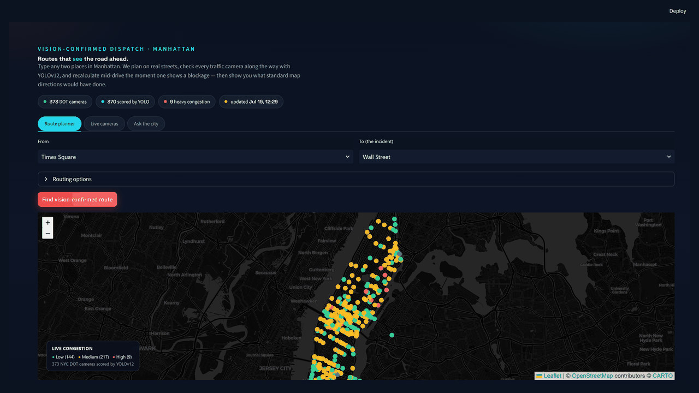
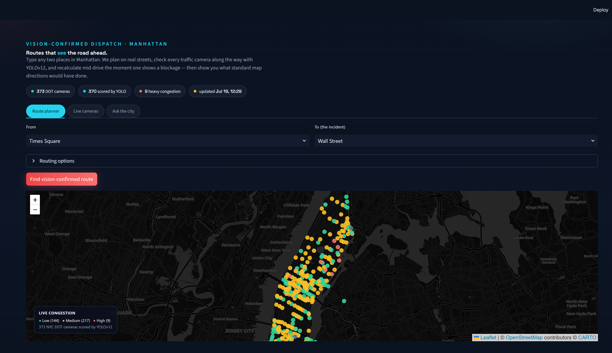
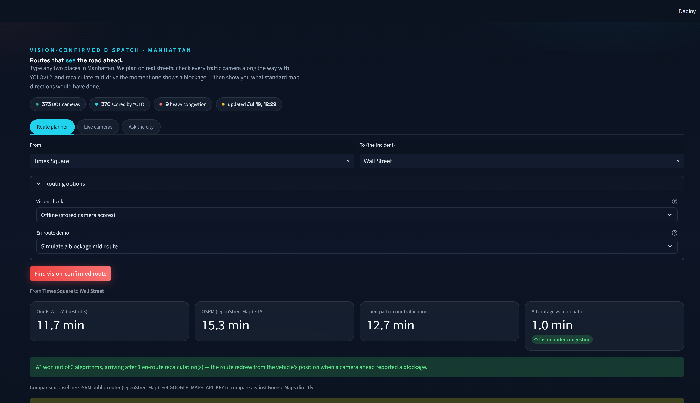
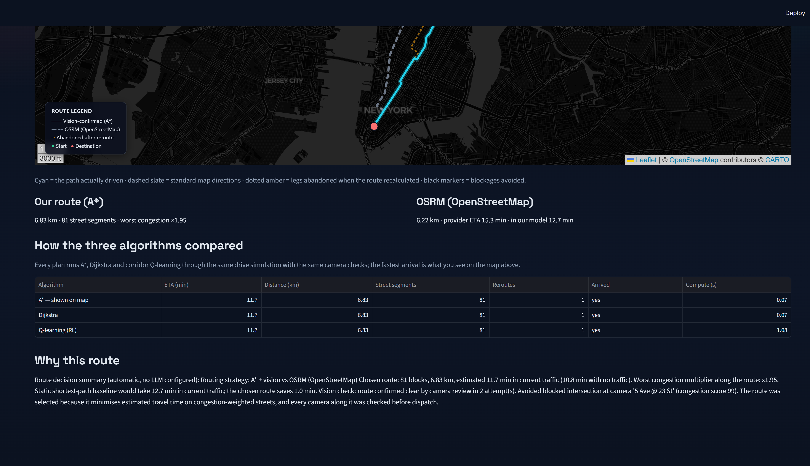
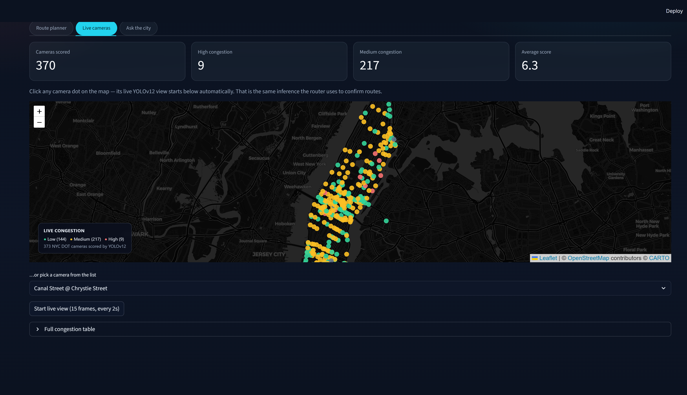
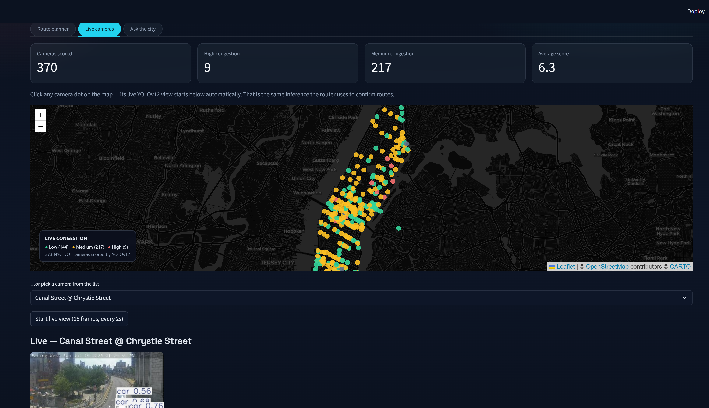

# Emergency Routing for Smart Response

**Vision-confirmed emergency dispatch for Manhattan** — plan on real streets, check live NYC DOT cameras with YOLOv12 before entering an intersection, and recalculate mid-drive when a camera reports a blockage. Then show the public what standard map directions would have done.



| What it is | What it is *not* |
|---|---|
| A navigator that adds a **vision signal** on top of the same graph architecture production maps use | A replacement for Google Maps traffic models |
| An end-to-end system: cameras → scores → street graph → plan → drive → explain → Docker | A notebook that prints “94% accuracy” |
| A public Streamlit UI with honest OSRM / Google comparison | A private research prototype |

---

## The problem (and the constraint)

Standard directions optimise for *typical* traffic. They **cannot see** a blocked intersection on a live DOT camera feed. Emergency dispatch cannot afford that blind spot.

**Constraint we designed around:** keep the road *topology* fixed (OpenStreetMap drive network), and apply live conditions as **edge-weight multipliers** — the same pattern production navigators use — then add vision as the missing sensor.

---

## What you see in the dashboard



*Landing view: dark mission-control UI, type-ahead From/To search, live congestion map.*



*Every plan runs A\*, Dijkstra, and corridor Q-learning; the fastest arrival is shown on the map.*


*Cyan = path actually driven · dashed slate = OSRM/Google · amber = legs abandoned after mid-drive recalculation · black markers = blockages avoided.*



*Scroll down for an honest side-by-side of all three planners (ETA, distance, reroutes, compute).*





*Click a camera on the map → live YOLOv12 inference starts below (same signal the router uses).*

---

## Measured impact

Benchmark over 30 simulated emergencies with **hidden road blockages** (`python -m routing.simulate`):

| Strategy | Mean response time | vs baseline |
|---|---|---|
| Static shortest-path baseline | 26.9 min | — |
| A\* + vision gate | 21.8 min | **−18.8%** |
| Q-learning + vision gate | 22.5 min | **−16.4%** |

The win is not “smarter A\*.” It is **excluding roads a camera shows are impassable before the vehicle commits**, then recalculating from the vehicle’s current position — the same UX people expect from Google Maps after a wrong turn, driven by vision instead of GPS probes.

---

## Design decisions (why not the obvious approach)

These are the questions senior ML interviews actually ask. Answers live in the code, not just this file.

| Tempting approach | Why we did not | What we did instead |
|---|---|---|
| Synthetic grid graph (fast to code) | Routes cut through parks / water — useless for a public demo | Real OSM street network, curved edge geometry preserved (`routing/streets.py`) |
| Tabular Q-learning on the full 10k-node city graph | Demo must answer in seconds; full-graph RL is not tractable | Corridor Q-learning around the A\* spine (`routing/rl_agent.py`) |
| Rebuild the topology when traffic changes | Production navigators never do this; fragile and slow | Fixed DiGraph + congestion multipliers on edges |
| Let the user pick A\* / Dijkstra / RL | Public users should not tune algorithms | Run all three, show the best, document the rest in a table |
| Trust Google / OSRM as ground truth for ETA | Their path may still pass a vision-blocked camera | Re-score *their* polyline in *our* congestion model for an honest gap |
| Hit Nominatim on every keystroke | 1 req/s rate limit → fake “not found” errors | Landmarks + camera-name suggestions first; Nominatim only if local hits are thin |
| Stage blockage demos in live YOLO mode | Live mode must reflect real cameras, not staged scores | En-route blockage demo only in offline mode |

---

## How it works

```
NYC DOT cameras ──► fetch_cameras.py ──► manhattan_cameras.csv
                                              │
                            update_camera_stats.py (YOLOv12 per camera)
                                              │
                                       camera_stats.csv
                                              │
              ┌───────────────────────────────┴───────────────────────────────┐
              │                        routing/ package                        │
              │  streets.py        real OSM street graph (cached GraphML)      │
              │  planners.py       Dijkstra / A* / static baseline             │
              │  rl_agent.py       corridor Q-learning under congestion noise  │
              │  navigator.py      drive with camera lookahead + recalculation │
              │  vision_gate.py    live / offline camera scores                │
              │  geocode.py        Manhattan-bounded place search + suggestions│
              │  external_route.py Google Directions → OSRM → naive fallback   │
              │  map_view.py       Folium dual-route + congestion map          │
              │  explain.py        LLM justification (template fallback)       │
              │  simulate.py       benchmark vs static baseline                │
              └───────────────────────────────┬───────────────────────────────┘
                                              │
                         dashboard.py  (Streamlit — Route planner first)
```

**Drive loop (Google-Maps-style):** plan → look ahead at the next few cameras → if blocked, cut that intersection and **replan from the current node** → draw abandoned legs faded on the map.

---

## Quick start

### Local (Python 3.11+)

```bash
python -m venv .venv
# Windows: .venv\Scripts\activate
# Linux/macOS: source .venv/bin/activate
pip install -r requirements.txt

# Optional — refresh cameras (CSVs ship in the repo)
python fetch_cameras.py
python update_camera_stats.py

# Benchmark
python -m routing.simulate --episodes 30

# Dashboard
streamlit run dashboard.py
```

Self-tests: `python -m routing.geo`, `python -m routing.map_view`, `python -m routing.geocode`, `python -m routing.navigator`, `python -m routing.streets`.

Street cache: `data/manhattan_streets.graphml` (refresh with `python -m routing.streets --build`).

### Docker

```bash
docker build -t emergency-routing .
docker run -p 8501:8501 emergency-routing
```

Open http://localhost:8501. CPU-only image; includes weights + camera CSVs + street cache.

### Optional keys

```bash
export GOOGLE_MAPS_API_KEY="..."   # true Google Directions compare (else OSRM)
export OPENAI_API_KEY="..."        # richer route explanations (else template)
# or: LLM_PROVIDER=anthropic + ANTHROPIC_API_KEY
```

---

## Dashboard tabs

| Tab | Behaviour |
|---|---|
| **Route planner** | Type-ahead From/To (Manhattan only). Runs A\*, Dijkstra, RL; map shows the winner; scroll for the comparison table. Live YOLO is default; staged blockage demo appears only in offline mode. |
| **Live cameras** | Congestion map of every DOT camera. Click a dot → live YOLOv12 view. |
| **Ask the city** | LLM chat grounded strictly in current camera scores. |

Out-of-coverage searches (e.g. “Newark Airport”) return a clear **Manhattan only** error instead of routing into the void.

---

## Stack

- **Vision:** Ultralytics YOLOv12 on NYC DOT JPEG snapshots → congestion score
- **Graph:** NetworkX DiGraph from OSMnx / OpenStreetMap (`data/manhattan_streets.graphml`)
- **Planners:** Dijkstra, A\* (admissible time heuristic), corridor tabular Q-learning
- **Navigation:** `drive_route` with multi-camera lookahead + en-route recalculation
- **Compare:** Google Directions API → public OSRM → offline free-flow baseline
- **UI:** Streamlit + Folium (dark tiles) + streamlit-searchbox
- **Deploy:** Docker (headless Streamlit on `:8501`)

---

## Repository layout

```
dashboard.py              # public UI
fetch_cameras.py          # NYC DOT camera index
update_camera_stats.py    # YOLO city-wide scoring
routing/                  # planners, navigator, streets, geocode, maps
docs/assets/              # screenshots + demo.gif
data/manhattan_streets.graphml
weights/yolov12s.pt
```

---

## What this project is meant to demonstrate

Aligned with how senior ML hiring actually evaluates work: **process and constraints**, not a tool list.

1. **End-to-end ownership** — data pull → model inference → graph system → UI → container
2. **Constraint thinking** — latency of RL, Nominatim rate limits, offline Docker demos, honest baselines
3. **Production-shaped navigation** — fixed topology, live weights, en-route recalculation
4. **Communication** — public map + plain-English explanation, not a matplotlib grid

Repo: https://github.com/likith17/traffic-monitoring
